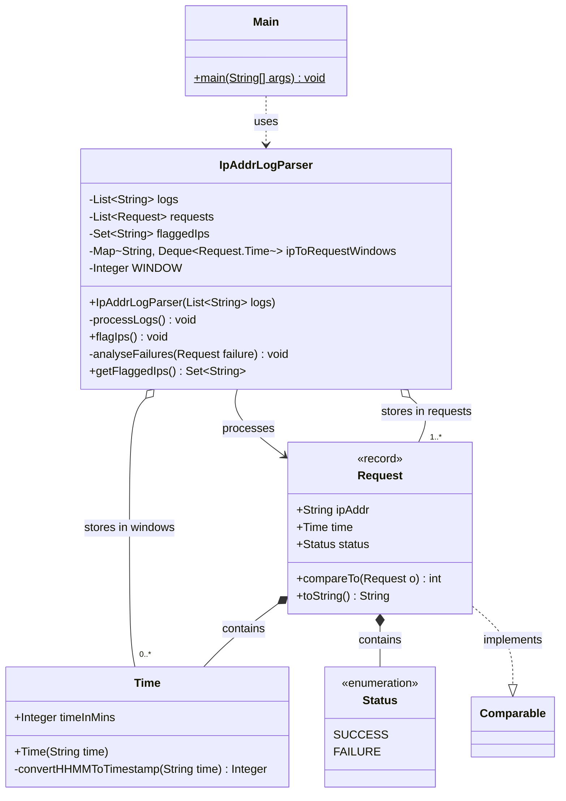

```mermaid
classDiagram
    class Main {
        +main(String[] args)$ void
    }
    
    class IpAddrLogParser {
        -List~String~ logs
        -List~Request~ requests
        -Set~String~ flaggedIps
        -Map~String, Deque~Request.Time~~ ipToRequestWindows
        -Integer WINDOW
        +IpAddrLogParser(List~String~ logs)
        -processLogs() void
        +flagIps() void
        -analyseFailures(Request failure) void
        +getFlaggedIps() Set~String~
    }
    
    class Request {
        <<record>>
        +String ipAddr
        +Time time
        +Status status
        +compareTo(Request o) int
        +toString() String
    }
    
    class Time {
        +Integer timeInMins
        +Time(String time)
        -convertHHMMToTimestamp(String time) Integer
    }
    
    class Status {
        <<enumeration>>
        SUCCESS
        FAILURE
    }
    
    Main ..> IpAddrLogParser : uses
    IpAddrLogParser --> Request : processes
    IpAddrLogParser o-- "1..*" Request : stores in requests
    IpAddrLogParser o-- "0..*" Time : stores in windows
    Request *-- Time : contains
    Request *-- Status : contains
    Request ..|> Comparable : implements
```